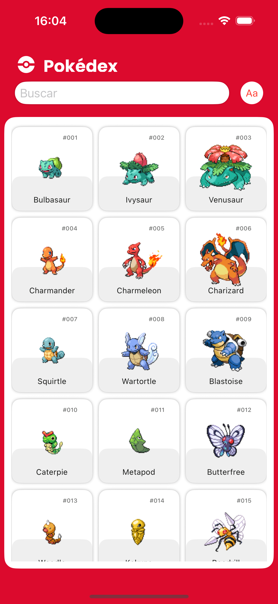
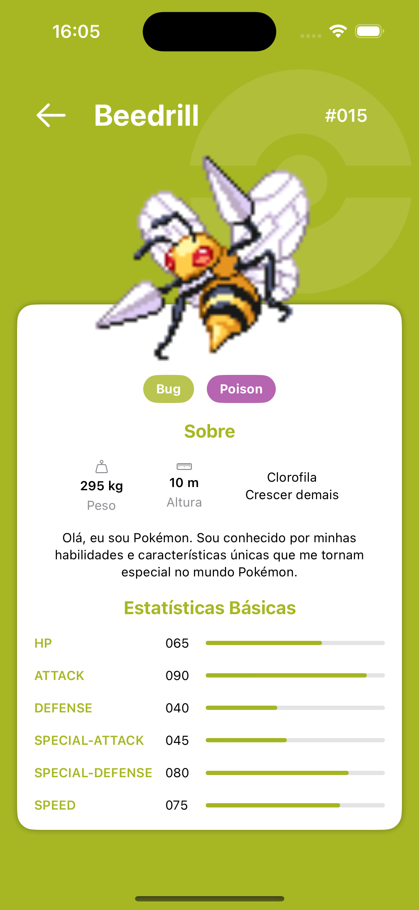
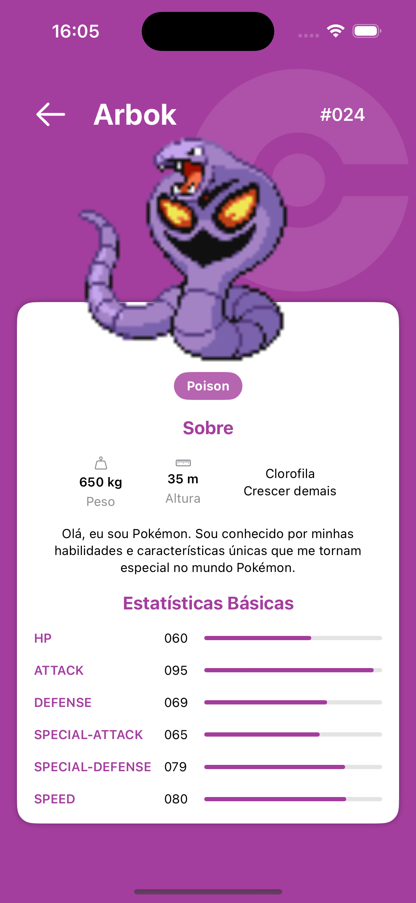
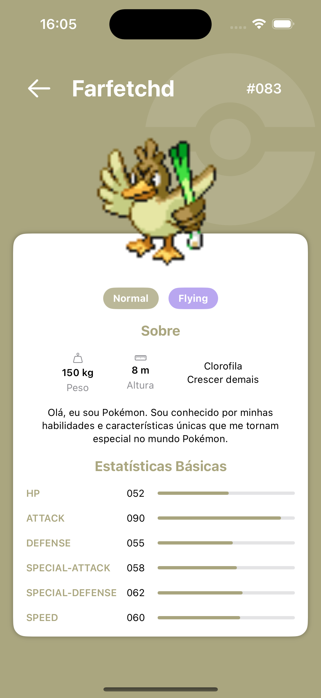

# App Pokémon
 Esse aplicativo simula uma `Pokédex` consumindo a lista e detalhes dos Pokémons da webApi [https://pokeapi.co].
 
  ### Projeto desenvolvido ultilizando:
  - [x] Swift 6.
  - [x] MVVM.
  - [x] SwiftUI.
  - [x] Animações.
  - [x] SPM `Swift Pakage Manager` - Lottie [https://lottiefiles.com]
  - [x] Consumo webApi [https://pokeapi.co] usando `URLSession`.
  - [x] Protótipo utilizado: `Pokédex` [https://www.figma.com/design/PQ8Y1PSe9JPgsJBl9sryEG/Pokédex--Community-?node-id=314-3&p=f] .
  
 ## Print Screen :foggy:
 
|  |  |  |  |
|:---:|:---:|:---:|:---:|
| Lista Pokémons | Detalhes Pokémon | Detalhes Pokémon | Detalhes Pokémon |

## Gif :space_invader:

|  |
|:---:|
| Pokédex |

### :point_up: Créditos Design: 

:rocket: Ricardo Schiniegoski [https://www.figma.com/@ricardohs]
